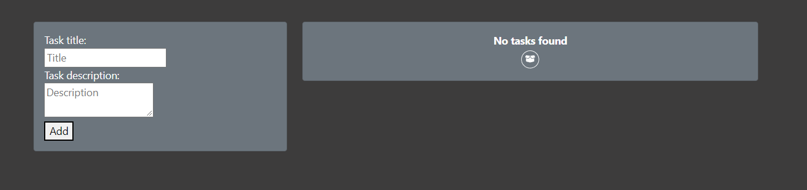
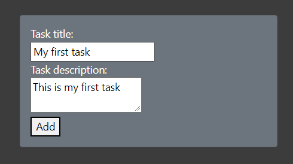
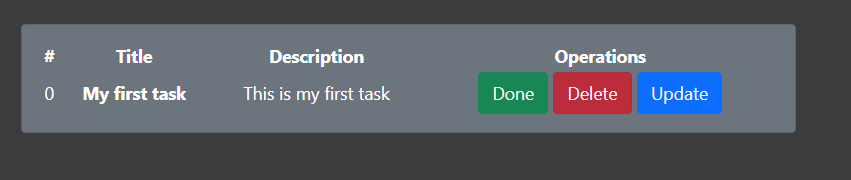
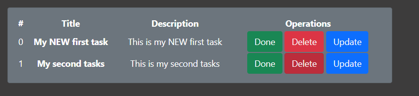
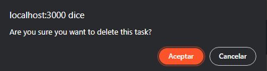
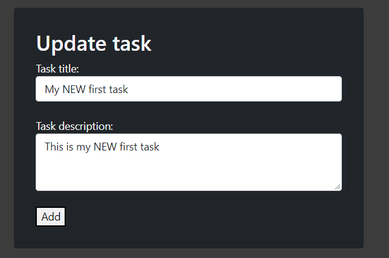

# Task_manager_CRUD
Personal project for practice MongoDB and Mongoose for Node.js.  
API for organize Tasks - Apply an NO-SQL database

# Developer: *Joaquin Labrador 👨‍💻*
**Warning:** This project uses Node.js version: >=v18.0.0 since it uses native fetch API that is not supported in previous versions without installing a dependency. Please install Node.js version >=v18.0.0 to run this project.

# Screenshots 📸
### Home page

### Add a task

### Tasks table

### Delete task

### Confirm delete

### Update form 

